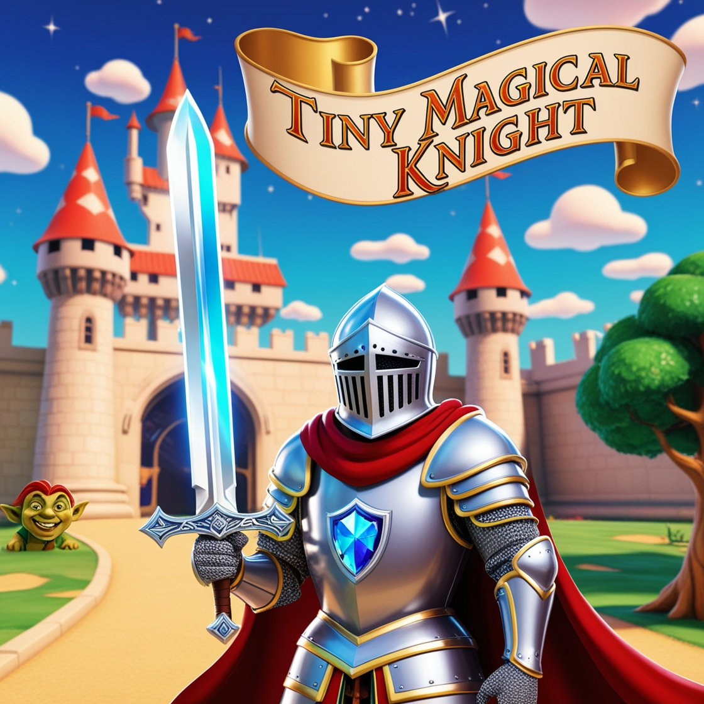

# Desafio de Projeto: Tiny Magical Knight 🗡✨

Esse é o meu primeiro jogo! Desenvolvido através do Godot Engine como projeto final do bootcamp Santander 2024 - Criando Jogos com Godot, em parceria com a DIO. A formação teve duração de 3 meses, de 29 de abril à 29 de julho de 2024.

## Objetivo 

O desafio proposto pelo Rafa Skoberg tinha por objetivo criar um "jogo jogável", utilizando os conhecimentos adquiridos ao longo do curso para construir um protótipo de jogo e explorar alguns passos além do que foi passado. Desenvolvi um jogo em que você é um cavaleiro medieval que deve lutar contra os inimigos, coletar itens e correr - muito! Passeie pelo mapa e tente sobreviver o máximo de tempo que conseguir!

## Comandos 👩🏻‍💻

| Ação          |   Teclas         |
| ------------- | ------------- |
| Mover         | W, A, S, D ou teclas de seta            |
| Atacar           | Espaço ou botão esquerdo do mouse           |
| Ritual         | Ataque em área disparado automaticamente de forma recorrente            |

## Recursos do jogo 👾

- Animação de personagens: player e inimigos
- Personagens com comportamento de ataque e dano
- Trilha sonora e efeitos sonoros
- Player com sistema de ataque em 4 diferentes direções
- Itens coletáveis: 'meat' regenera a vida e 'gold coins' aumenta a pontuação
- Interface de Game Over com estatísticas da partida

## Acesse o projeto 

https://michellemaus.itch.io/tiny-magical-knight

